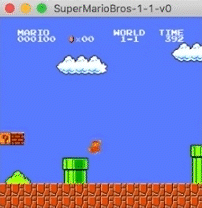
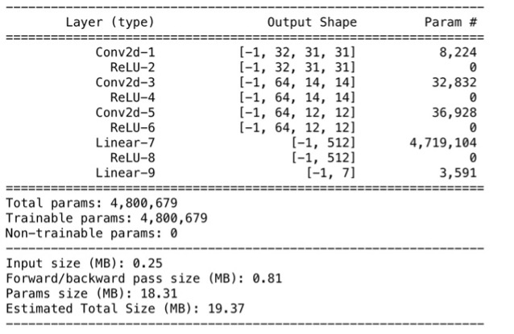
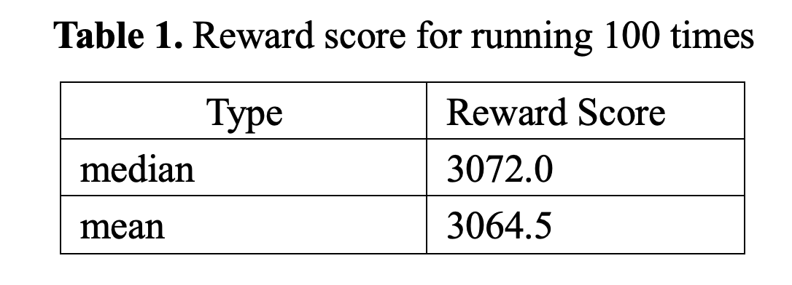
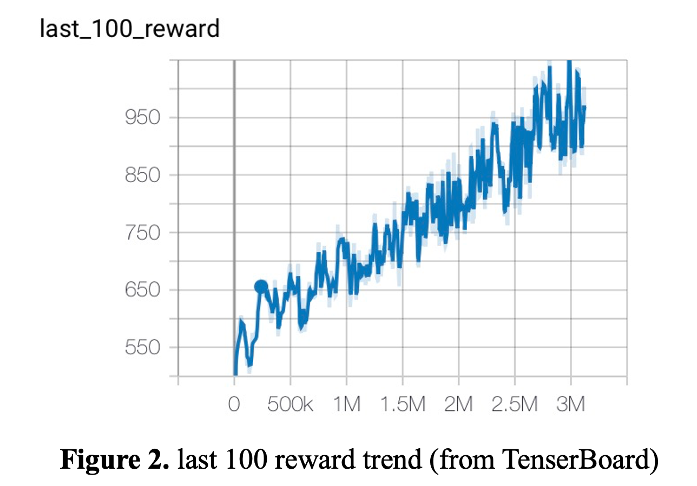

# Deep Reinforcement Learning with Mario Games

Apply a DQN model to play Mario games by Shiqi Zheng. Final Project for [CIS4930 Deep Learning for Computer Graphics Fall 2020](https://coreytolerfranklin.com/course/cis6930-4930-deep-learning-for-computer-graphics-fall-2020/) instructed by [Dr. Corey Toler-Franklin](https://coreytolerfranklin.com) at [University of Florida](https://www.cise.ufl.edu).


## Introduction
Demo
<p align="center">
    
</p>

DQN Super Mario Player Structure Overview
<p align="center">
    
</p>

To read more details, please view [Deep Reinforcement Learning with Mario Games.pdf](Docs/Deep%20Reinforcement%20Learning%20with%20Mario%20Games.pdf).


## Setup
### Install `python` and `jupyter` environment
```
conda create -n DQN_SuperMario python=3.7 jupyter   # You can also use other environment.
```

### Install other dependencies
```
pip install -r requirements.txt
```


## Training
Use `jupter notebook` to run [DQN_super_mario.ipynb](DQN_super_mario.ipynb).  
It takes a while to train, and if you do not want to wait, [Local_DQN_Mario_big_4](Local_DQN_Mario_big_4) is a trained model that can be used to play the game.


## Testing
Use `jupter notebook` to run [Mario_Play.ipynb](Mario_Play.ipynb) with the model created in the [Training](#training).


## Result
The 100 times rewards results are summarized in Table 1.
<p align="center">
    
</p>

The last 100 reward trend is shown in Figure 2.
<p align="center">
    
</p>


## Acknowledgements
- Part of the code is built based on *[Playing Atari with Deep Reinforcement Learning](https://www.cs.toronto.edu/~vmnih/docs/dqn.pdf)* by Mnih, Volodymyr, et al.
- Also thanks to John N Tsitsiklis and Benjamin Van Roy and their paper *An analysis of temporal-difference learning with function approximation*. Automatic Control, IEEE Transactions on, 42(5):674–690, 1997.
- Thanks to [Deep-Reinforcement-Learning-Hands-On](https://github.com/PacktPublishing/Deep-Reinforcement-Learning-Hands-On/blob/master/Chapter06/lib/wrappers.py) and [REINFORCEMENT LEARNING (DQN) TUTORIAL](https://pytorch.org/tutorials/intermediate/reinforcement_q_learning.html).